# Manifesto - Identidade Visual Da Techmmunity

## Sumário

- [Sobre a Techmmunity](https://github.com/techmmunity/visual-identity#sobre-a-techmmunity)
  - [Nossa Missão](https://github.com/techmmunity/visual-identity#nossa-miss%C3%A3o)
  - [Nossos Visão](https://github.com/techmmunity/visual-identity#nossa-vis%C3%A3o)
  - [Nossos Valores](https://github.com/techmmunity/visual-identity#nossos-valores)
- [A Estrutura da Techmmunity](https://github.com/techmmunity/visual-identity#a-estrutura-da-techmmunity)
  - [Primeira Camada - A Empresa](https://github.com/techmmunity/visual-identity#primeira-camada---a-empresa)
  - [Segunda Camada - Os Setores](https://github.com/techmmunity/visual-identity#segunda-camada---os-setores)
  - [Terceira Camada - Os Produtos](https://github.com/techmmunity/visual-identity#terceira-camada---os-produtos)
- [O Logo](https://github.com/techmmunity/visual-identity#o-logo)
  - [Algo Abstrato](https://github.com/techmmunity/visual-identity#algo-abstrato)
  - [Algo Icônico](https://github.com/techmmunity/visual-identity#algo-ic%C3%B4nico)
  - [Algo Flexível](https://github.com/techmmunity/visual-identity#algo-flex%C3%ADvel)
- [Exemplos De "Algo Icônico"](https://github.com/techmmunity/visual-identity#exemplos-de-algo-ic%C3%B4nico)
  - [Oi](https://github.com/techmmunity/visual-identity#oi)
  - [Logo Bom Aleatório 1](https://github.com/techmmunity/visual-identity#logo-bom-aleat%C3%B3rio-1)
  - [Logo Bom Aleatório 2](https://github.com/techmmunity/visual-identity#logo-bom-aleat%C3%B3rio-2)
- [Exemplos De Consistência Visual Entre Produtos Da Mesma Marca](https://github.com/techmmunity/visual-identity#exemplos-de-consist%C3%AAncia-visual-entre-produtos-da-mesma-marca)
  - [Google](https://github.com/techmmunity/visual-identity#google)
  - [Atlassian](https://github.com/techmmunity/visual-identity#atlassian)
  - [Elastic](https://github.com/techmmunity/visual-identity#elastic)
- [Exemplos de Logos Ruins](https://github.com/techmmunity/visual-identity#exemplos-de-logos-ruins)
  - [Logo Ruim Aleatório 1 - Linhas](https://github.com/techmmunity/visual-identity#logo-ruim-aleat%C3%B3rio-1---linhas)
  - [Logo Ruim Aleatório 2 - Clichês](https://github.com/techmmunity/visual-identity#logo-ruim-aleat%C3%B3rio-2---clich%C3%AAs)
  - [Logo Ruim Aleatório 3 - Complexidade](https://github.com/techmmunity/visual-identity#logo-ruim-aleat%C3%B3rio-3---complexidade)
  - [Logo Ruim Aleatório 4 - Simplicidade](https://github.com/techmmunity/visual-identity#logo-ruim-aleat%C3%B3rio-4---simplicidade)
  - [Logo Ruim Aleatório 5 - Forma](https://github.com/techmmunity/visual-identity#logo-ruim-aleat%C3%B3rio-5---forma)
  - [Logo Ruim Aleatório 6 - Animais](https://github.com/techmmunity/visual-identity#logo-ruim-aleat%C3%B3rio-6---animais)
- [O Que Pensamos Até Agora Para a Identidade Visual](https://github.com/techmmunity/visual-identity#o-que-n%C3%B3s-pensamos-at%C3%A9-agora-para-a-identidade-visual)
  - [Empresa](https://github.com/techmmunity/visual-identity#empresa)
  - [Setores](https://github.com/techmmunity/visual-identity#setores)
  - [Produtos](https://github.com/techmmunity/visual-identity#produtos)
- [O Que Queremos Evitar](https://github.com/techmmunity/visual-identity#o-que-queremos-evitar)
- [Algumas Considerações](https://github.com/techmmunity/visual-identity#algumas-considera%C3%A7%C3%B5es)
- [O Buscamos Neste Projeto](https://github.com/techmmunity/visual-identity#o-buscamos-neste-projeto)
- [Resultado Final - Prova de Conceito Inicial](https://github.com/techmmunity/visual-identity#resultado-final---prova-de-conceito-inicial)
  - [Logos](https://github.com/techmmunity/visual-identity#logos)
    - [Staff](https://github.com/techmmunity/visual-identity#staff)
    - [Programação](https://github.com/techmmunity/visual-identity#programa%C3%A7%C3%A3o)
    - [Design Gráfico](https://github.com/techmmunity/visual-identity#design-gr%C3%A1fico)
    - [Sonoplastia](https://github.com/techmmunity/visual-identity#sonoplastia)
    - [Eng. Robótica](https://github.com/techmmunity/visual-identity#eng-rob%C3%B3tica)
    - [Gestão](https://github.com/techmmunity/visual-identity#gest%C3%A3o)
    - [Marketing](https://github.com/techmmunity/visual-identity#marketing)

## Sobre a Techmmunity

Somos uma comunidade de **pessoas apaixonadas por tecnologia** que decidiram montar a própria empresa para **ajudar outras pessoas apaixonadas por tecnologia** a resolverem os mais variados **problemas do dia-a-dia**.

Nossa empresa será 100% digital, então não teremos **absolutamente nada** físico (nada de papelaria, nada de camisetas, nada de loja física, etc.).

Traçamos um plano de atuação com a duração de vários e vários anos, onde pretendemos expandir cada vez mais a empresa e atuarmos em **todos** os setores relacionados a tecnologia.

Para que possamos expandir e nos estabelecer no mercado sem medo ou risco de perdermos a imagem que construímos, precisamos de uma identidade visual flexível e consistente. Os requisitos para uma identidade visual assim serão melhor explicados no decorrer desse manifesto.

#### Nossa Missão

```
A missão da Techmmunity é prover os recursos necessários para que as pessoas possam mudar o mundo através da tecnologia.
```

Fazemos isso criando uma comunidade com um ambiente agradável e amigável, onde pessoas podem trocar conhecimentos, fazer networking e formar times, onde juntos, possam mudar o mundo.

Nos recursos que comentamos, podem ser enquadrados: conhecimento, pessoas, mão de obra, empregos, conexões, ferramentas e diversas outras coisas.

#### Nossa Visão

```
"Nada que valha a pena jamais foi construído por uma pessoa sozinha."
```

Um dos pontos principais que permitiram que a humanidade se tornasse a espécie dominante do planeta, é sem dúvida o fato de que a humanidade se tornou cada vez **mais especializada** e **menos generalista**.

Isso significa que ao invés de todos os membros de uma sociedade fazerem múltiplas tarefas de forma medíocre, cada uma delas se torna especialista em algo, e passa a fazer aquela tarefa muito melhor do que se ela estivesse dividindo seus esforços com várias outras skills.

Aqui na Techmmunity, nós não acreditamos em unicórnios. Tudo que valha a pena não é construído por uma pessoa excepcional, e sim por um grupo de pessoas ótimas. O trabalho em equipe foi o que trouxe a humanidade até aqui, e é o que vai guiar a humanidade ao infinito e além.

[]()

Nós ensinamos de tudo, sim, mas não com o objetivo de que todos os membros de nossa comunidade estudem todos os conteúdos que produzimos, e sim com o objetivo de ensinar cada um deles um tópico específico que seja do interesse dele, e essa pessoa entrar em um time, com outras pessoas com interesses diferentes, e juntos, mudarem o mundo do jeito deles.

> O que é um unicórnio na área de TI? Um unicórnio é alguém que consegue fazer o trabalho de 2 ou mais pessoas, com a mesma qualidade e em um espaço de tempo muito curto. Um unicórnio sozinho seria um departamento de Ti todo, ou seja, um semi-deus.

#### Nossos Valores

Sobre nossos valores, sem dúvida, um video dirá mais do que qualquer texto:

[Apes Together Strong](https://www.youtube.com/watch?v=20LuSlZT4S4)

## A Estrutura da Techmmunity

Para entendermos melhor a marca, precisamos primeiro entender a estrutura da empresa e nossos planos para o futuro.

A Techmmunity tem uma estrutura de 3 camadas: A Empresa, Os Setores e Os Produtos.

[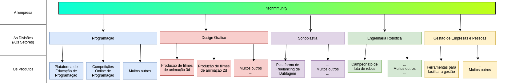](./assets/techmmunity-structure.png)

#### Primeira Camada - A Empresa

A Primeira camada da Techmmunity é a empresa em si, aquilo que engloba todo o resto, esse é o núcleo da empresa e é a partir dele que as coisas se desenrolam.

[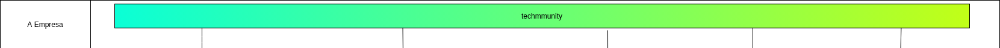](./assets/techmmunity-structure-company.png)

#### Segunda Camada - Os Setores

Essa camada são os setores de atuação da Techmmunity, todos voltados para o setor de tecnologia. Eles são independentes uns dos outros, porém tem uma relação com a Techmmunity.

[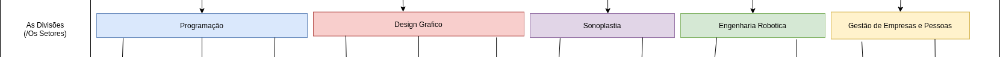](./assets/techmmunity-structure-divisions.png)

#### Terceira Camada - Os Produtos

Essa é a parte que nossos consumidores _realmente tem acesso_, nossos produtos e serviços, as partes _palpáveis_ da empresa. Cada setor da Techmmunity tem vários produtos e serviços.

[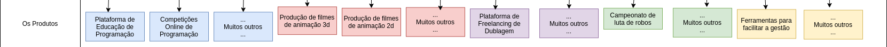](./assets/techmmunity-structure-products.png)

Não pretendemos começar a empresa atuando em todos os setores de uma vez, mas sim com apenas um deles, e quando já estivermos bem estabelecidos no mercado, começar a expandir para outros setores.

Para que possamos aproveitar toda a reputação que construímos no primeiro setor, precisamos de uma marca que esteja preparada para ter essa flexibilidade, podendo manter a consistência, gerando familiaridade para nossos clientes.

Decidimos começar pelo setor de **Programação**, pois é a área em que temos mais conhecimento e capacidade de fazer algo de maior qualidade.

## O Logo

O ponto mais importante de qualquer empresa é seu logo, é o símbolo que representa a empresa. O logo é para a empresa o que a bandeira é para um país, no quesito de importância e propósito.

No ramo digital da tecnologia, tendo como foco nossa empresa, existem algumas exigências para que uma identidade visual seja perfeita, e algumas delas se aplicam diretamente ao logo:

#### Algo Abstrato

A criação de algo abstrato representaria melhor e daria mais flexibilidade para a marca do que algo mais lúcido, que representasse "Tecnologia" ou "Counidade", ou qualquer outro conceito que faça parte de nossa filosofia e propósito.

Um bom exemplo para isso seria: caso usássemos um animal como logo, será que poderíamos usar o mesmo animal ou animais diferentes seguindo o mesmo estilo visual, para **todos** os setores e **todos** os produtos da Techmmunity? Provavelmente não, ou seria bem difícil de encaixar, além de existirem um número limitado de animais, e cada um deles representa um conceito pré estabelecido. Criar um novo conceito, algo "Especial da Techmmunity", seria mais facil para quebrarmos expectativas e ocuparmos um lugar único na mente de nossos clientes. "A Techmmunity é única, [existe uma caixinha só para ela](file:///home/razal/Downloads/296-Texto%20do%20Artigo-991-1-10-20071110.pdf)"

#### Algo Icônico

Temos vários exemplos de logos abstratos que são irreconhecíveis e inclassificáveis. Precisamos que o logo tenha a medida certa de abstração e ludicidade, para que seja possível **entender que aquilo é algo**, não necessariamente algo que exista, pode ser um conceito novo, uma "mancha / borrão / amoeba" que tenha uma certa característica ou estilo que identifique aquilo como **único**.

A pessoa precisa reconhecer aquele símbolo, reconhecer que ele é diferente de outros símbolos, caso contrário ele falha em seu principal propósito.

Lembrando que o reconhecimento também se aplica a acessibilidade. No mundo moderno, devemos sempre pensar na inclusão de pessoas com certas deficiências, um exemplo seria o daltonismo, que não reconheceria um logo pela sua cor, e sua forma de identificar o logo seria baseada principalmente no formato do mesmo.

[Exemplos de versões minimalistas e vetorizadas de logos](https://simpleicons.org/) (Lembrando que **esses são logos de produtos**, por isso precisam ter uma cor principal, já que são referenciados em outros lugares onde precisam ser minimalistas e ter apenas 1 cor. **_Nossos produtos terão que ter essa preocupação, já nossa empresa não_**)

#### Algo Flexível

Por ser abstrato, em teoria, o símbolo deveria ter maior flexibilidade para mudanças, assim sendo possível adaptá-lo ou parodiá-lo, gerando assim novos símbolos para nossos diferentes setores e produtos.

Temos vários exemplos disso, e cada um desses exemplos tem seus pontos que devem ser levados em consideração e suas falhas que devem ser entendidas e corrigidas.

### Exemplos De "Algo Icônico"

#### Oi

[]()

O melhor exemplo disso sem dúvidas é a identidade visual da Oi. Ela é simplesmente genial e além de cumprir todos os requisitos para ser perfeita, ainda [entrega coisas a mais](https://temporalcerebral.com.br/novo-logo-da-oi-massacra-ignorantes-voce-sabe-por-que/).

A identidade visual da Oi é única, reconhecível independe do quanto for alterada, pois mantém uma estrutura básica e um conceito principal.

[]()

A Oi também tem um "logo principal", que é o mais usado e o mais reconhecido da empresa. Por essa imagem de exemplo ser mais antiga, ela ainda usa apenas a cor amarela, mas podemos observar que nas propagandas e casos-de-uso mais recentes, a Oi já adota as cores degradê mais variadas:

[]()

[]()

**Observações e Reconsiderações:** Como a Oi possui apenas um único produto, realmente fica mais fácil para que ela crie uma identidade visual, já que ela não é flexível e que "mude apenas um pouquinho" de produto para produto. É uma identidade visual perfeita para um produto, mas não muito boa para uma empresa.

#### Logo Bom Aleatório 1

[]()

Esse logo é bem carregado, cheio de elementos, porém é possível criar uma versão minimalista dele, deixando apenas a parte rosa com o H vazado, desse modo o logo continuaria reconhecível.

Aqui também temos um bom exemplo da diferença de **logo carregado** e **logo complexo**. Apesar do logo ter vários elementos, todos eles são extremamente minimalistas, compostos apenas por formas geométricas e cores sólidas, sem nenhum detalhe a mais super complexo.

#### Logo Bom Aleatório 2

[]()

Esse é um ótimo logo para uma empresa, ele abre muitas possibilidades para a criação de logos para os produtos da empresa a partir do conceito de "textura de triangulos", mantendo a mesma identidade visual tanto para os produtos quanto para a empresa.

Ele é exemplo da diferença entre **logo texturizado** e **logo com várias partes**. Perceba que apesar do logo visualmente ser formado por várias partes menores, essas partes se completam de tal maneira que isso forma uma textura, e passamos a entender o logo como uma peça única.

Uma outra coisa muito especial deste logo, é que se você reparar bem, existe um "T" 3D escondido na imagem. Esse logo é sensacional, flexivel, iconico, tem _quase_ tudo que um logo precisa ter, a unica coisa que faltaria seria fazer com que ele encaixe em alguma identidade visual amigavel, já que ele é composto de triangulos e o [Bouba/KiKi Effect](https://uxplanet.org/rounded-or-sharp-corner-buttons-def3977ed7c4) faz com que isso seja complicado de se conceber (porém, acredito que não seja impossivel).

Aqui mais um exemplo de logo texturizado, onde é possível perceber a diferença que ele tem de um logo complexo:

[]()

### Exemplos De Consistência Visual Entre Produtos Da Mesma Marca

#### Google

[]()

A nova identidade visual dos produtos da Google, que combinam com a identidade visual principal da empresa, é muito boa em manter uma consitencia visual, porém, tem algumas falhas, que devem ser consideradas primeiro que os acertos.

Suas 2 maiores falhas, que tornam essa identidade visual **inutilizável** por qualquer outra companhia que não tenha a fama da Google, nascem junto do conceito da identidade visual.

A identidade visual da Google é baseado em 2 principais pilares: **linhas e um padrão de cores**.

Deixar que estes 2 pilares (principalmente as linhas) sejam os carros fortes da sua identidade visual daria uma dor de cabeça absurda não apenas para a própria empresa, mas também para outras pessoas que queiram fazer uma referência a ela através de seus símbolos.

**O problema das linhas**, é que uma versão minimalista e vetorizada para ser usada como ícones ([como exemplificado aqui](https://simpleicons.org/)), não ficaria boa e muito provavelmente não seria facilmente reconhecível. Talvez uma empresa tão famosa quanto o Google possa se dar a esse luxo, mas no nosso caso, nós com certeza não podemos.

**O problema com o padrão de cores**, é que ele não tem apenas um problema, e sim vários (e mesmo assim, é menos grave do que o problema das linhas). Segundo as reclamações de vários usuários, "Agora todos eles parecem ser a mesma coisa", o que é uma frase que tem uma pegadinha muito importante para qualquer designer.

Afinal, o que é uma identidade visual se não uma forma de fazer com que os clientes da empresa reconheçam que todos aqueles itens fazem parte da empresa, correto? Muito correto. A pegadinha nisso é a sutil diferença entre "fazer parte" e "ser a mesma coisa". Não podemos esquecer que um produto, por mais que faça parte da empresa, **não é a empresa**. Assim como um filho e um pai são pessoas diferentes, por mais que compartilhem uma semelhança muito grande em seu DNA e façam parte da mesma familia.

Fazendo com que as logos de **diferentes produtos** tenham as **exatas mesmas cores** e o **exato mesmo estilo**, faz com que os clientes vejam aquilo como sendo a **mesma coisa**, e não como "partes de um todo". No exemplo que usamos anteriormente, sobre pai e filho, imagine o seguinte: O pai e o filho são os produtos, enquanto a **família** é a empresa.

---

Agora que já falamos sobre os erros da identidade visual da Google, podemos comentar sobre seus acertos.

O maior acerto dessa identidade visual é também um dos seus defeitos: Ela mantém uma **consistência visual** entre os produtos. Apesar de exagerar nessa consistência, é inegável que os produtos são reconhecíveis como sendo parte da Google pela maior parte das pessoas.

Outro ponto positivo, é que a identidade visual da Google (a empresa, não seus produtos) sempre foi **colorida**, representando a **diversidade** tanto das opiniões da empresa, quanto dos produtos dela, quanto dos usuários de seus produtos. Isso é uma coisa incrível que acreditamos que se encaixa muito bem com a filosofia da Techmmunity (como empresa, não de nossos produtos).

#### Atlassian

[]()

Atlassian é uma empresa que de forma parecida ao Google (e a Techmmunity), tem o objetivo de resolver problemas do dia-a-dia das pessoas. Sua grande diferença é que os produtos que ela cria são ferramentas para que seus usuários possam realizar seus trabalhos de forma mais eficiente.

Acredito que o exemplo mais conhecido seja o Trello, um sistema de Kanban para organizar tarefas amplamente usado por empresas.

Como ela tem diversos produtos, ela precisa manter uma consistência visual entre eles. A maior parte deles não é icônico ou muito bom, mas eles fazem um ótimo trabalho em criar logos diferentes uns dos outros, mas que mantenham a mesma identidade visual.

[]()

Apesar dos logos dos produtos não serem muito icônicos, o logo da empresa em si é bem reconhecível e icônico, ao mesmo tempo que é abstrato, é também bem lúcido, tem a medida certa das duas coisas. É uma letra "A" (algo lúcido), porém desenhada de forma abstrata.

Não é a melhor identidade visual que existe, mas ainda assim é muito boa.

#### Elastic

[]()

Elastic é uma empresa que surgiu através de um produto, o **ElasticSearch**. Seu principal foco era facilitar a busca por coisas (Tipo uma barra de busca do google, só que interna pro seu website, o que pode parecer super banal, mas acredite, é extremamente revolucionário).

Com o tempo, eles foram expandindo seus produtos, e hoje é uma das maiores empresas focadas em coleta de logs do mundo.

Eles tem inúmeros produtos, mas todos eles seguem uma mesma identidade visual. Ela é muito icônica e extremamente reconhecível, o único ponto negativo é que ela só funciona com cores, e não funcionaria em preto e branco.

[]()
[]()

### Exemplos de Logos Ruins

#### Logo Ruim Aleatório 1 - Linhas

[]()

A ideia deste logo é muito boa, o formato é bem icônico, porém a forma com que ele é executado não é das melhores. O maior problema é que ele é feito de linhas, e pior ainda: São linhas formando um logo vazado.

Linhas sempre são uma opição ruim para logos de empresas digitais, pois ao "delimitar áreas do logo" as linhas aumentam a "complexidade visual" do mesmo, dando a entender que existem mais "partes" / "elementos" no logo do que realmente existem, tornando o logo muito carregado e complexo.

Se esse logo fosse "cheio" ao invés de ser vazado, até seria um bom logo, porém a escolha de fazê-lo com linhas faz com que ele não seja utilizável.

#### Logo Ruim Aleatório 2 - Clichês

[]()

Esse logo, além de ter o mesmo problema das linhas, cai em um clichê do setor de tecnologia, o uso de "circutos".

Circuitos são "linhas com bolinhas nas pontas". Isso é um clichê do setor, e pessoalmente, me passa a impressão de uma empresa falida que foi fundada em 2013.

Aqui estão alguns exemplos desse tipo de logo:

[]()
[]()

E aqui estão alguns exemplos de backgrounds clichês:

[]()
[]()
[]()

#### Logo Ruim Aleatório 3 - Complexidade

[]()

Um logo pode ser carregado (com muitos elementos, [como foi exemplificado aqui](https://github.com/techmmunity/visual-identity#logo-bom-aleat%C3%B3rio-1)), desde que não seja complexo.

Esse é muito complexo, tem MUITOS detalhes. Minimalismo é sempre uma coisa boa a ser considerada.

#### Logo Ruim Aleatório 4 - Simplicidade

[]()

Esse é um logo simples, direto, sem mistério, sem sal, sem abstração nenhuma, é descarado, é totalmente esquecível. Não tem graça, não é icônico, são apenas as iniciais do nome da empresa.

Se estivéssemos na idade média seria um bom logo, mas nos dias atuais, é péssimo.

Mais exemplos disso:

[]()

#### Logo Ruim Aleatório 5 - Forma

[]()

Logos sempre devem seguir um formato mais quadrado / redondo, para que possam ser usados em redes sociais, ícones, etc., e ocuparem um espaço uniforme.

Esse logo de exemplo é retangular, o que causa um desconforto.

#### Logo Ruim Aleatório 6 - Animais

[]()

Quando um animal é usado para representar uma empresa, o logo se prende a algo que já existe e já tem um conceito previo formado na mente das pessoas. Águias, Leões, são animais clichês que limitam o potencial da empresa, são lucidos de mais.

## O Que Pensamos Para a Identidade Visual

Assim como a estrutura da Techmmunity, a identidade visual deve ser dividida em três partes: Empresa, Setor e Produto.

#### Empresa

Acreditamos que a melhor inspiração para a identidade visual de nossa empresa são as **Skins Arcade**, de League of Legends. Seguem algumas imagens de referencia:

[]()
[]()
[]()
[]()
[]()
[]()
[]()
[]()
[]()

Sobre a tipografia, escolhemos a fonte [Fipps](https://www.dafont.com/pt/fipps.font?fpp=200&a=on&l[]=10&l[]=1&text=techmmunity) para escrever o nome da empresa, e a [Roboto](https://www.dafont.com/pt/roboto.font) para textos em geral.

Para o logo, escolhemos a letra `t`, em minusculo e usando a fonte Fipps.

#### Setores

Todos os setores da Techmmunity terão o mesmo logo e seguirão a mesma identidade visual da empresa, o unico diferencial serão **as cores**. Cada setor da Techmmunity terá sua cor especifica, sendo elas:

[]()
[]()
[]()
[]()
[]()
[]()
[]()

#### Produtos

Cada produto terá uma cor principal baseada na categoria a qual aquele produto faz parte, mudando apenas o tom dessa cor. Por exemplo: O setor de programação tem uma cor azul mais clara, um produto desse setor terá um tom de azul escuro.

## O Que Queremos Evitar

- O uso da cor roxa como cor primária. A cor roxa vem sido saturada nos últimos anos, acreditamos que em um período muito próximo do futuro as pessoas vão enjoar de ver tanto roxo, gerando um pensamento subconsciente de "nossa, mais uma identidade visual roxa". A Techmmunity é uma empresa fora da curva, longe da caixinha, queremos fugir dos clichês.

## Algumas Considerações

- Sabemos que o uso de conceitos pré estabelecidos ajudam a poupar muito dinheiro em propaganda, pois fazem com que nossos clientes já tenham uma familiariedade prévia com a marca, porém, nós não temos medo de desafios e acreditamos que vale a pena apostar no diferente, no abstrato, aceitarmos a missão de despertar a curiosidade de nossos clientes atraves da criatividade e de nossa qualidade. Sermos diferentes é o que nós torna fortes, é nossa razão de existir.
- Nossos sites, plataformas, produtos, redes sociais, terão como modo primaŕio o **Dark Mode**, por isso, a tonalidade das cores deve ser pensada para se adaptar melhor a esses backgrounds mais escuros. [Aqui um artigo que pode ajuda a entender melhor o Dark Mode](https://uxplanet.org/8-tips-for-dark-theme-design-8dfc2f8f7ab6).

## O Buscamos Neste Projeto

Queremos ir avançando por partes, com calma, para que o resultado saia bem feito e com o mínimo de tentativas possíveis.

Então, queremos apenas 3 coisas:

- Um logo para a **empresa** techmmunity.
- Uma identidade visual para a **empresa** techmmunity.
- Um logo para nosso primeiro **produto** (do setor de programação), uma plataforma online para a postagem de artigos.

São poucas, porém bem complexas, por isso queremos primeiro deixar isso pronto e muito bem feito, para depois pensarmos em mais coisas relacionadas ao design.

## Resultado Final - Prova de Conceito Inicial

### Logos

#### Staff

[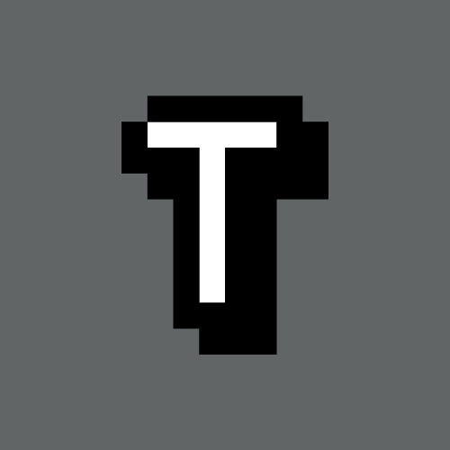]()

#### Programação

[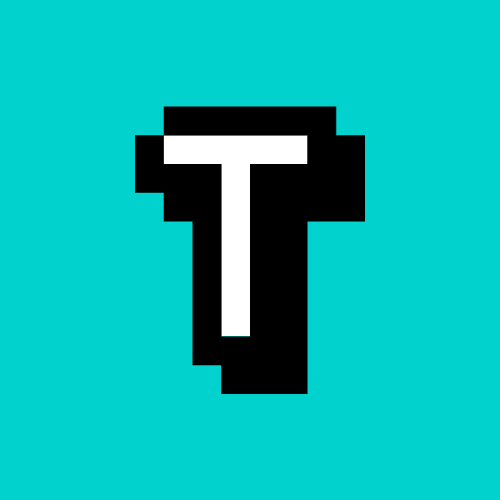]()

#### Design Gráfico

[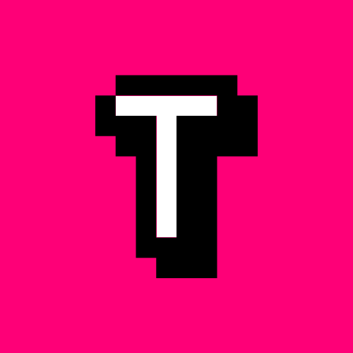]()

#### Sonoplastia

[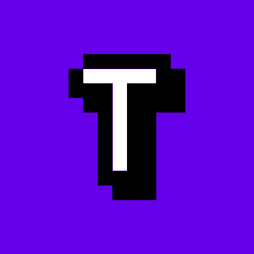]()

#### Eng. Robótica

[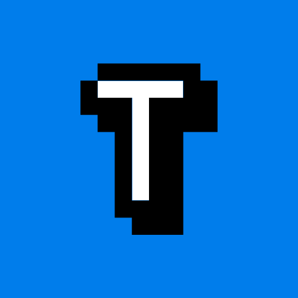]()

#### Gestão

[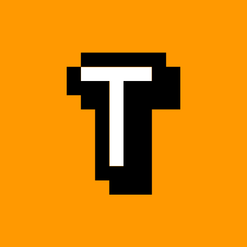]()

#### Marketing

[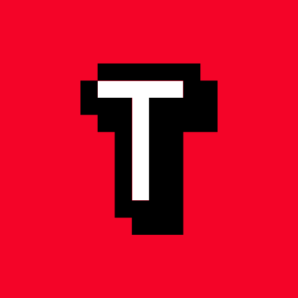]()
